<!-- ===================== HEADER ===================== -->

  

  

  
  
  
  
  
  

  

---

<!-- ===================== ABOUT ===================== -->
## 👋 About Me

- 💻 Full-stack developer who builds responsive, user-friendly web apps
- 💼 Freelance web developer helping small businesses get online
- 🌱 Currently learning: React, MongoDB, PostgreSQL & TypeScript
- 🤝 Open to software engineering roles and freelance projects
- 🚀 Passionate about game development, robotics & AI
- 🎬 Outside of code: sci-fi, suspense-thriller & horror movies, and playing soccer ⚽

---

<!-- ===================== TECH STACK ===================== -->
## 🛠️ Tech Stack

<h4 align="center">Languages & Frontend</h4>

  

<h4 align="center">Backend & Databases</h4>

  

<h4 align="center">Tools & Deployment</h4>

  

---

<!-- ===================== STATS ===================== -->
## 📊 GitHub Stats

  
  

  

  

---

<!-- ===================== DAILY QUOTE ===================== -->
<!-- QUOTE:START -->

<i>"The secret of getting ahead is getting started."</i> — Mark Twain

<!-- QUOTE:END -->

<!-- ===================== FOOTER ===================== -->

  

